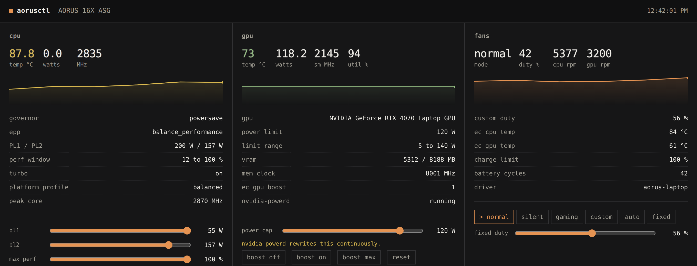

# aorus-dashboard

Fan control, power limits and live dashboards for Gigabyte AORUS and AERO
laptops on Linux.

I wrote this for my own AORUS 16X because nothing else worked on it. Gigabyte
has no Linux build of Control Center, NBFC has no config for the recent chassis,
`nbfc-linux` wants embedded controller register offsets nobody has published for
them, and the TUXEDO drivers only bind to Clevo and TUXEDO boards. It has since
been tidied up enough to be worth publishing, but it started as a personal fix
and the hardware coverage still reflects that.



```
aorusctl status                    # snapshot
sudo aorusctl mon                  # live terminal dashboard
sudo aorusctl web                  # browser dashboard on http://127.0.0.1:8787
sudo aorusctl profile apply cool
sudo aorusctl reset                # undo everything
```

## What it does

Fans: the firmware's own modes (normal, silent, gaming, custom, auto, fixed),
fixed duty, and its 15-point curve, with RPM and duty readout for both fans.

CPU: sustained and burst package power limits (RAPL PL1 and PL2), a ceiling on
the `intel_pstate` performance window, turbo, governor and energy performance
preference.

GPU: NVIDIA power limit, hard clock lock, and the EC-side Dynamic Boost toggle.

Plus a curses dashboard for the terminal, a self-contained browser dashboard
with history graphs and working controls, named profiles in one TOML file, and
the battery charge limit and cycle count.

## How it talks to the hardware

Fans go through the `aorus-laptop` WMI kernel driver, which calls the same ACPI
methods Control Center uses on Windows. CPU limits use mainline `intel-rapl`,
`intel_pstate` and `cpufreq` sysfs. GPU limits go through `nvidia-smi`. Nothing
writes the embedded controller directly, which is what makes the `p37-ec-*`
scripts you find online dangerous on the wrong model.

The kernel module is not part of this repository. `install.sh` downloads
[tangalbert919/gigabyte-laptop-wmi](https://github.com/tangalbert919/gigabyte-laptop-wmi)
at a pinned commit, verifies its SHA-256, and builds it through DKMS.

## Hardware

Tested on an AORUS 16X ASG (i7-14650HX, RTX 4070 Laptop) running Ubuntu 24.04,
kernel 6.8. That is the only machine this has run on.

The fan half should work on anything the upstream driver supports: all AERO
models, all AORUS models, Gigabyte Gaming 2025 and newer, and some P-series.
Sabre and pre-2025 Gigabyte Gaming models are rebadged Clevo boards and will not
work.

The CPU and GPU halves are generic. They work on any Intel machine with
`intel-rapl` and any NVIDIA GPU with `nvidia-smi`, Gigabyte or not.

If your model is not listed, run `sudo ./probe.sh` first. It only reads, and the
report says which interfaces your firmware exposes. Reports from untested models
are welcome as issues.

## Install

```sh
git clone https://github.com/vladkoisnych/aorus-dashboard
cd aorus-dashboard
sudo ./install.sh --check     # see what it would do, changes nothing
sudo ./install.sh
```

If the module fails to build or fails to bind, the installer says so and carries
on. The CPU and GPU halves work with no module at all.

| Flag | Effect |
|---|---|
| `--check` | dry run, changes nothing |
| `--no-driver` | install the tool only, no kernel module |
| `--driver-dir DIR` | build from a local checkout instead of downloading, for offline installs |
| `--driver-ref REF` | build a different upstream commit, branch or tag, skipping checksum verification |

To remove everything and put the hardware back to firmware defaults:

```sh
sudo ./uninstall.sh
```

With Secure Boot on, the installer generates a machine owner key, signs the
module, and runs `mokutil --import`. You then reboot once and approve the key on
the blue MOK management screen. See
[TROUBLESHOOTING.md](TROUBLESHOOTING.md#secure-boot) for the details and for what
to do when it goes wrong.

## Use

> **Warning.** Fan curves and power limits are yours to get wrong. A curve that
> ramps too late, a fixed duty set too low, or a raised power limit can let the
> machine run hotter than the firmware would ever allow, and sustained heat
> shortens the life of the hardware. Expect thermal shutdowns from a bad
> configuration, and treat anything that lowers fan speed or raises power as
> something to watch under load before you leave it running. `aorusctl reset`
> undoes everything, and `sudo aorusctl fan auto` hands the fans straight back to
> the firmware.
>
> The CPU and GPU keep their own hardware thermal throttling, which nothing here
> can disable, so a bad configuration costs performance and stability rather than
> instantly destroying anything. It is still your machine and your risk.

```sh
aorusctl status                    # no root needed
aorusctl status --json             # for scripts
sudo aorusctl mon                  # live terminal dashboard
sudo aorusctl web                  # browser dashboard, loopback only

sudo aorusctl fan mode gaming      # normal silent gaming custom auto fixed
sudo aorusctl fan speed 60         # pin the fans at 60 percent
sudo aorusctl fan curve 45:15,55:25,65:40,72:55,80:70,86:85,92:100
sudo aorusctl fan auto             # hand the fans back to the firmware
aorusctl fan show

sudo aorusctl cpu pl1 45           # sustained package watts
sudo aorusctl cpu pl2 110          # burst package watts
sudo aorusctl cpu maxpct 70        # cap the intel_pstate performance window
sudo aorusctl cpu turbo off
sudo aorusctl cpu epp power
aorusctl cpu show

sudo aorusctl gpu limit 100        # watts, ignored by most laptop vBIOSes
sudo aorusctl gpu boost 2          # EC Dynamic Boost: 0 off, 1 on, 2 max
sudo aorusctl gpu clocks 210,1800  # hard SM clock lock, MHz
sudo aorusctl gpu reset
aorusctl gpu show

sudo aorusctl profile apply silent
aorusctl profile list
sudo aorusctl reset
```

Add `--dry-run` to anything to see the exact sysfs writes without performing
them.

In `aorusctl mon`: `q` quit, `n` normal, `s` silent, `g` gaming, `1` to `9` pin
the fans at 10 to 90 percent.

### Profiles

`/etc/aorusctl/config.toml` ships with `silent`, `balanced`, `gaming`, `battery`
and `cool`. A profile is a bundle of the settings above. Anything the hardware
refuses is reported as skipped and the rest still applies.

```toml
[profiles.cool]
fan_mode        = "custom"
fan_curve       = [[40,15],[50,25],[60,40],[68,55],[75,70],[82,85],[88,100]]
cpu_pl1         = 45
cpu_pl2         = 80
turbo           = true
epp             = "balance_performance"
gpu_clocks      = [210, 1600]
```

### The fan daemon

`aorusctl fan curve` writes into the firmware's own curve, so nothing has to keep
running. `aorusctld` exists for a curve driven by sensors the EC cannot see. It
tracks the hottest of CPU, GPU and EC temperatures, drives the fans in fixed
mode, and forces 100 percent at or above `guard_temp`.

A fan mode you pick by hand always wins: setting one stops the daemon and says
so. When the daemon stops for any other reason, killed included, it hands the
fans back to the firmware.

### GNOME top bar

`gnome-extension/` holds a GNOME Shell extension that puts CPU and GPU
temperature, fan speed and the current fan mode in the top bar, with quick fan
mode buttons and a shortcut that opens the dashboard.

```sh
cd gnome-extension
./install.sh                 # as your normal user, not with sudo
gnome-extensions enable aorusctl@vladkoisnych.github.io
```

Log out and back in first on Wayland, or press Alt+F2 and type `r` on X11.

It reads from `aorusctl-web.service` over loopback, so it needs no privileges of
its own. Without that service running it falls back to reading sysfs, which
still gives temperatures and fan readings but no GPU data and no controls.
`gnome-extensions prefs aorusctl@vladkoisnych.github.io` chooses what appears in
the panel. It follows the desktop light and dark setting.

### Running at boot

`install.sh` puts three systemd units in place and leaves all of them disabled.

| Unit | What it does |
|---|---|
| `aorusctl-web.service` | keeps the browser dashboard up on http://127.0.0.1:8787 |
| `aorusctld.service` | runs the software fan curve and thermal guard |
| `aorusctl-profile.service` | applies one profile at every boot |

`--now` acts immediately as well as changing what happens at boot:

```sh
sudo systemctl enable --now aorusctl-web.service
sudo systemctl disable --now aorusctl-web.service
systemctl status aorusctl-web.service
journalctl -u aorusctld -f
```

The profile unit needs one extra step, since you pick which profile first. It
ships pointing at `balanced`:

```sh
sudo sed -i 's/apply balanced/apply cool/' /etc/systemd/system/aorusctl-profile.service
sudo systemctl daemon-reload
sudo systemctl enable --now aorusctl-profile.service
```

Disabling that one runs `aorusctl reset` through `ExecStop`. `uninstall.sh`
removes all three units for you.

## Safety

Writes are clamped to what the kernel or firmware reports, GPU writes are read
back and a change that did not stick is reported as a failure, and the original
value of anything changed is recorded in `/var/lib/aorusctl/state.json` so
`aorusctl reset` can put it back. The web dashboard binds to `127.0.0.1` and
refuses control requests from anywhere else.

On a dual boot, the fan curve, charge limit and GPU boost live in EC registers
Control Center writes too, so whichever OS booted last wins.

## Something not working

Start with the probe, which is read only:

```sh
sudo ./probe.sh
```

[TROUBLESHOOTING.md](TROUBLESHOOTING.md) covers what the report contains, Secure
Boot, fans stopping at high duty, GPU power limits that will not move, Dynamic
Boost, and the errors that look like permission problems but are not.

## Not covered

- RGB keyboard. A different interface entirely, `ite-8291` and OpenRGB
  territory.
- Writable `pwmX` hwmon nodes. The upstream driver exposes them read-only, so
  fixed mode plus `fan speed` is how you set duty for now.
- A separate GPU fan curve. The EC drives both fans from one curve on these
  chassis.
- Undervolting. Locked on 13th and 14th gen HX by Intel microcode. PL1, PL2 and
  `maxpct` are the levers you have instead.

## Credits

The kernel driver is Albert Tang's
[gigabyte-laptop-wmi](https://github.com/tangalbert919/gigabyte-laptop-wmi),
GPL-2.0-or-later. Reverse engineering Gigabyte's WMI interface was the hard part
and it is his work. This repository installs it and builds tooling on top.

Earlier attempts at the same problem, all writing the EC directly:
[jertel/p37-ec](https://github.com/jertel/p37-ec),
[tangalbert919/p37-ec-aero-15](https://github.com/tangalbert919/p37-ec-aero-15),
[s-h-a-d-o-w/alfc](https://github.com/s-h-a-d-o-w/alfc).

## License

MIT, see [LICENSE](LICENSE).

The kernel driver is licensed separately under GPL-2.0-or-later by its authors.
It is downloaded from upstream at install time and is not redistributed here.
